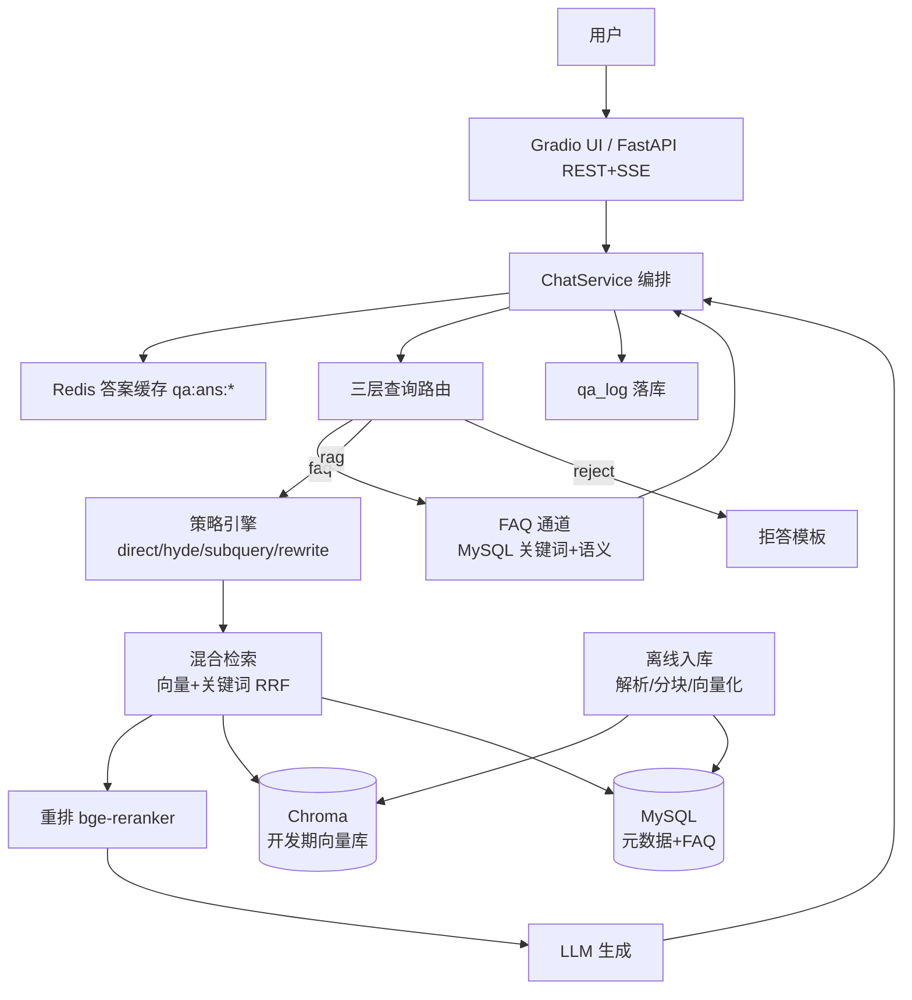

# EduQA 课程问答助手

面向职业教育学员的**技术知识智能问答平台**：FAQ 秒答 + 复杂问题 RAG 深度回答，支持按知识方向过滤、答案可溯源、多轮对话、流式输出。

> 硬约束说明：本仓库代码、注释、文档与提交信息中不包含任何第三方机构、平台或人员名称；语料均为自建通用技术知识（见 `data/SOURCES.md`）。

## 功能特性

- **双通道分流**：FAQ 快速通道（MySQL）+ RAG 深度链路（向量检索 + 重排 + 生成）
- **三层查询路由**：L1 规则词 / L2 FAQ 语义相似度 / L3 LLM 分类 → `faq | rag | reject`
- **四种检索策略**：direct / HyDE / subquery / rewrite（多轮改写）
- **混合检索 + 重排**：向量召回 + 关键词召回 RRF 融合，bge-reranker-large 精排（sigmoid 归一化）
- **三级缓存**：答案缓存 `qa:ans:*` + 会话历史 `qa:list:*` + MySQL FAQ 兜底；FAQ 热点榜 `qa:faq:hot`
- **多轮对话 + 流式输出**：会话历史改写、SSE 逐 token 输出、引用溯源
- **两种前端**：Gradio 界面（对话 / 知识库 / 统计看板）+ FastAPI REST/SSE 服务
- **可复现评估**：金标集 + 分流正确率 / 拒答正确率 / Recall@5 三组对比（见 `EVALUATION.md`）

## 总体架构



### 分流示意图

```
用户提问
   │
   ├─ Redis 答案缓存命中？──────────── 直接返回（qa:ans:*）
   │
   ├─ 三层路由判定 intent
   │     ├─ reject ── 拒答模板（也写缓存，短 TTL）
   │     ├─ faq    ── FAQ 通道检索 → 命中返回；未命中降级 RAG
   │     └─ rag    ── 策略引擎选策略 → 混合检索 → 重排 → 生成
   │
   └─ 结果落库 qa_log + 写回缓存
```

## 技术栈

| 组件 | 选型 | 说明 |
|---|---|---|
| 语言 | Python 3.10+（开发用 3.12） | |
| Web | FastAPI + Uvicorn + Gradio 6.x | REST + SSE + 图形界面 |
| LLM | DeepSeek（OpenAI 兼容接口） | 缺 key 自动降级 MockLLM |
| Embedding | BGE-M3（sentence-transformers） | 1024 维，normalize 后入库 |
| 重排 | bge-reranker-large | 本地加载，CPU 可用 |
| 向量库 | Chroma（开发期） | schema 与 Milvus 对齐，生产可平滑切换 |
| 关系库 | MySQL 8.0 | FAQ / knowledge_doc / knowledge_chunk / qa_log |
| 缓存 | Redis 7 | 答案缓存 / 会话历史 / 热点榜 / 并发锁 |
| 评估 | 自研 evaluate.py | RAGAS 待接入（见 EVALUATION.md） |

> 说明：实现采用原生 openai / sentence-transformers / chromadb 直连，未引入 LangChain 编排层，减少抽象与依赖。

## 快速开始

### 0. 环境准备

- Python 3.10+，安装依赖：`pip install -r requirements.txt`
- Docker（用于拉起 MySQL / Redis）

### 1. 一键拉起依赖（MySQL + Redis）

```bash
docker compose up -d
```

### 2. 配置环境变量

```bash
cp .env.example .env
# 编辑 .env，填入 DEEPSEEK_API_KEY（不填则 LLM 自动降级为 Mock）
```

### 3. 初始化数据库（建表 + FAQ 种子）

```bash
python scripts/init_db.py
```

### 4. 入库示例语料

```bash
python scripts/ingest_demo.py
# 或通过前端「知识库」页上传 PDF / DOCX / TXT / MD
```

### 5. 启动服务

```bash
# 方式 A：Gradio 界面（含对话/知识库/统计看板）
python frontend/app.py

# 方式 B：FastAPI 服务（REST + SSE）
uvicorn app.api.main:app --host 127.0.0.1 --port 8000
```

打开 http://127.0.0.1:7860（Gradio）或 http://127.0.0.1:8000/docs（FastAPI Swagger）。

## 环境变量

| 变量 | 默认值 | 说明 |
|---|---|---|
| `LLM_PROVIDER` | mock | deepseek / dashscope / ollama / mock |
| `DEEPSEEK_API_KEY` | （空） | DeepSeek 密钥 |
| `DEEPSEEK_BASE_URL` | https://api.deepseek.com | |
| `DEEPSEEK_MODEL` | deepseek-chat | |
| `EMBED_MODEL_NAME` | BAAI/bge-m3 | 嵌入模型 |
| `RERANK_MODEL_NAME` | BAAI/bge-reranker-large | 重排模型 |
| `HF_ENDPOINT` | https://hf-mirror.com | HuggingFace 镜像（国内网络） |
| `MYSQL_HOST` / `MYSQL_PORT` | localhost / 3308 | |
| `MYSQL_USER` / `MYSQL_PASSWORD` / `MYSQL_DB` | eduqa / eduqa / eduqa | |
| `REDIS_HOST` / `REDIS_PORT` | localhost / 6380 | |
| `CHROMA_PERSIST_DIR` | ./data/chroma | 向量库持久化目录 |

## API 契约（FastAPI）

统一响应 `{"code":0,"data":{...},"msg":"ok"}`；错误码：1001 参数错 / 2001 无证据 / 3001 服务内部错 / 4001 文档入库失败。

| 方法 | 路径 | 说明 |
|---|---|---|
| POST | `/api/v1/chat` | 非流式问答 |
| POST | `/api/v1/chat/stream` | SSE 流式（route / token / citation / done 事件） |
| POST | `/api/v1/ingest` | multipart 文件入库（file + category） |
| GET | `/api/v1/sources?category=` | 文档列表 |
| GET | `/api/v1/stats?days=7` | 意图分布 / 策略分布 / 平均延迟 / FAQ Top |
| GET | `/api/v1/health` | mysql / redis / vector_store / llm 连通性 |

## 目录结构

```
app/
  api/           FastAPI 服务（main / schemas / deps / stats）
  config.py      配置（pydantic-settings，禁止硬编码）
  db/            MySQL/Redis 客户端 + FAQ/知识库/日志仓储
  embeddings/    BGE-M3 编码器
  llm/           DeepSeek/Mock 客户端
  ingest/        解析 / 分块 / 入库编排 / 元数据仓储
  rag/           路由 / FAQ / 策略 / 检索 / 重排 / 生成 / 缓存 / 会话 / 编排
  rerank/        bge-reranker 封装
frontend/        Gradio 界面
scripts/         建库 / 入库 / 评估 / 示例
tests/           单元测试（109 项）
data/
  docs/          示例语料
  eval/          金标集
  SOURCES.md     语料来源与授权
```

## 测试与评估

```bash
# 单元测试
python -m pytest tests/ -q

# 评估（产出 EVALUATION.md）
python scripts/gen_eval_set.py
python scripts/evaluate.py --eval-set data/eval/eval_set.jsonl --output EVALUATION.md
```

评估结果详见 `EVALUATION.md`（含复现命令与运行日期）。

## 效果截图

> 运行后抓取，替换以下占位：
>
> - `docs/screenshots/chat.png` —— 对话页（流式回答 + 引用来源）
> - `docs/screenshots/knowledge.png` —— 知识库管理页（上传 + 文档列表）
>
> 抓取方式：启动 `python frontend/app.py` 后在浏览器打开 7860 端口截图。

## 里程碑

| 阶段 | 内容 |
|---|---|
| M1 | 项目骨架 + 模型连通（配置 / LLM / Embedding / Rerank 封装 + CLI） |
| M2 | 入库链路（解析 / 分块 / 向量化 / Chroma+MySQL 落库） |
| M3 | RAG 主链路 + Gradio 前端（流式 + 引用 + 拒答） |
| M4 | FAQ 快速通道 + 三层路由 + 答案缓存 |
| M5 | 检索策略引擎 + 混合检索 + 评估系统 |
| M6 | 工程收尾（FastAPI 服务 + 多轮/缓存/日志 + 统计看板 + 交付文档） |
